# AI Learning Assistant — Complete Project Documentation

> **Project Title:** AI Learning Assistant — An Online Learning Platform  
> **Version:** 1.0  
> **Date:** March 2026  
> **Technology Stack:** React 18, TypeScript, Vite, Tailwind CSS, shadcn/ui, Supabase (PostgreSQL + Edge Functions)  
> **Live URL:** [https://ailearningassist.lovable.app](https://ailearningassist.lovable.app)

---

## Table of Contents

1. [Project Overview](#1-project-overview)
2. [How to Run](#2-how-to-run)
3. [Technology Stack](#3-technology-stack)
4. [System Architecture](#4-system-architecture)
5. [Module Descriptions](#5-module-descriptions)
6. [Database Design (ER Diagram)](#6-database-design-er-diagram)
7. [Data Flow Diagrams (DFD)](#7-data-flow-diagrams-dfd)
8. [Use Case Diagram](#8-use-case-diagram)
9. [Sequence Diagrams](#9-sequence-diagrams)
10. [Activity Diagrams](#10-activity-diagrams)
11. [Component Structure](#11-component-structure)
12. [Functional Requirements](#12-functional-requirements)
13. [Non-Functional Requirements](#13-non-functional-requirements)
14. [System Interfaces](#14-system-interfaces)
15. [Security & RLS Policies](#15-security--rls-policies)
16. [Testing Strategy](#16-testing-strategy)
17. [Deployment Architecture](#17-deployment-architecture)
18. [Future Enhancements](#18-future-enhancements)
19. [Diagram Files Index](#19-diagram-files-index)
20. [References](#20-references)

---

## 1. Project Overview

The **AI Learning Assistant** is a full-stack web application that provides:
- Interactive course browsing with lesson tracking
- AI-powered chatbot tutoring
- Quiz assessments with automated scoring
- AI-generated personalized study plans
- Real-time progress dashboards with analytics (GitHub-style activity heatmap)
- User authentication and profile management
- Study plan sharing and PDF export

### Problem Statement
Traditional learning systems suffer from lack of personalized study paths, no real-time progress tracking, limited access to instant tutoring, rigid schedules without adaptive learning, and manual grading delays.

### Proposed Solution
An AI-powered learning platform that automates quiz grading, generates personalized study plans, provides real-time analytics, and offers an AI tutor chatbot — all accessible from any device via a modern web interface.

---

## 2. How to Run

```sh
# Step 1: Clone the repository
git clone <YOUR_GIT_URL>

# Step 2: Navigate to the project directory
cd <YOUR_PROJECT_NAME>

# Step 3: Install dependencies
npm install

# Step 4: Start the development server
npm run dev
```

### Build for Production

```sh
npm run build
# Deploy the generated `dist/` folder to any static hosting
```

---

## 3. Technology Stack

| Layer | Technology | Purpose |
|-------|-----------|---------|
| UI Framework | React 18 | Component-based SPA |
| Language | TypeScript | Type-safe development |
| Build Tool | Vite 5 | Fast HMR & bundling |
| Styling | Tailwind CSS + shadcn/ui | Utility-first CSS + accessible components |
| State Management | TanStack React Query | Server state caching & synchronization |
| Routing | React Router v6 | Client-side routing with nested layouts |
| Animations | Framer Motion | Smooth UI transitions |
| Database | PostgreSQL (via Supabase) | Relational data storage |
| Authentication | Supabase Auth | JWT-based email/password auth |
| Serverless Functions | Supabase Edge Functions (Deno) | AI tutor & study plan generation |
| Realtime | Supabase Realtime | WebSocket subscriptions for live updates |
| Charts | Recharts | Data visualization (dashboards) |
| PDF Generation | jsPDF | Export study plans as PDF |
| Testing | Vitest + Testing Library | Unit & integration tests |

---

## 4. System Architecture

> 📄 Diagram file: `diagrams/01_system_architecture.mmd`

```
┌─────────────────────────────────────────────────────┐
│                    CLIENT BROWSER                    │
│  ┌──────────┐ ┌──────────┐ ┌──────────┐ ┌────────┐ │
│  │  React   │ │ React    │ │ Tanstack │ │Framer  │ │
│  │  Router  │ │ Context  │ │ Query    │ │Motion  │ │
│  └────┬─────┘ └────┬─────┘ └────┬─────┘ └────────┘ │
│       └─────────────┼───────────┘                    │
│                     │                                │
│            ┌────────▼────────┐                       │
│            │ Supabase JS SDK │                       │
│            └────────┬────────┘                       │
└─────────────────────┼───────────────────────────────┘
                      │ HTTPS / WebSocket
┌─────────────────────┼───────────────────────────────┐
│              SUPABASE BACKEND                        │
│  ┌──────────┐ ┌────▼──────┐ ┌──────────┐           │
│  │  Auth    │ │ REST API  │ │Realtime  │           │
│  │ (JWT)   │ │(PostgREST)│ │(WebSocket)│           │
│  └────┬─────┘ └────┬──────┘ └────┬─────┘           │
│       └─────────────┼────────────┘                   │
│              ┌──────▼──────┐                         │
│              │ PostgreSQL  │                         │
│              │ + RLS       │                         │
│              └──────┬──────┘                         │
│  ┌──────────────────┼──────────────────┐             │
│  │           Edge Functions            │             │
│  │  ┌──────────┐  ┌───────────────┐   │             │
│  │  │ai-tutor  │  │generate-study │   │             │
│  │  │          │  │-plan          │   │             │
│  │  └──────────┘  └───────────────┘   │             │
│  └─────────────────────────────────────┘             │
└──────────────────────────────────────────────────────┘
```

### Mermaid Diagram (System Architecture)

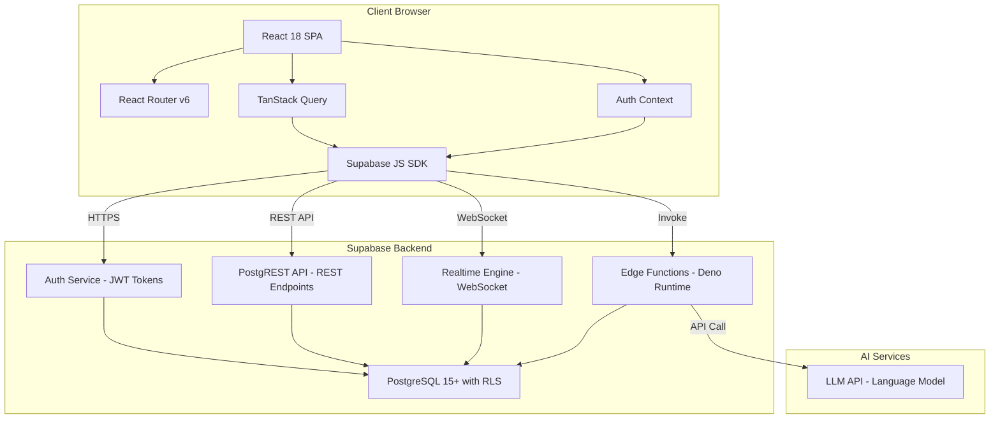

---

## 5. Module Descriptions

### 5.1 Authentication Module
- **Components:** `Auth.tsx`, `AuthContext.tsx`
- **Features:** Email/password signup & login, session management, protected routes, auto-redirect
- **Data Flow:** User credentials → Supabase Auth → JWT token → Session stored in context

### 5.2 Courses Module
- **Components:** `Courses.tsx`, `CourseDetail.tsx`
- **Features:** Browse 6 courses, view lessons, mark lessons complete, track progress
- **Tables:** `courses`, `lessons`, `user_progress`
- **Hooks:** `useCourses.ts`, `useTopicsProgress.ts`

### 5.3 Quizzes Module
- **Components:** `Quizzes.tsx`, `QuizImprovementSuggestions.tsx`
- **Features:** Take quizzes, auto-score answers, view explanations, track attempts
- **Tables:** `quizzes`, `quiz_questions`, `quiz_attempts`
- **Hooks:** `useQuizzes.ts`

### 5.4 AI Tutor Module
- **Components:** `AITutor.tsx`
- **Features:** Chat with AI tutor, conversation history, context-aware responses
- **Tables:** `chat_messages`
- **Edge Function:** `ai-tutor/index.ts`

### 5.5 Study Plan Module
- **Components:** `StudyPlan.tsx`, `StudyPlanGenerator.tsx`, `StudyPlanViewer.tsx`, `SharePlanDialog.tsx`, `LearningGoals.tsx`, `WeeklySummary.tsx`, `StudyAchievements.tsx`
- **Features:** AI-generated study plans, share via link, export PDF, set goals, track weekly progress
- **Tables:** `study_plans`, `study_session_completions`, `shared_study_plan_links`, `learning_goals`
- **Edge Function:** `generate-study-plan/index.ts`

### 5.6 Dashboard / Analytics Module
- **Components:** `Dashboard.tsx`, `ActivityHeatmap.tsx`, `StrengthsWeaknesses.tsx`, `StudyStreakWidget.tsx`
- **Features:** Study streak tracking, activity heatmap (GitHub-style), quiz performance analytics, strengths/weaknesses analysis
- **Hooks:** `useStudyStreak.ts`, `useActivityHeatmap.ts`, `useWeeklyProgress.ts`, `useRealtimeProgress.ts`

### 5.7 Settings Module
- **Components:** `Settings.tsx`, `LearningPreferences.tsx`
- **Features:** Profile management, learning level preferences, preferred subjects
- **Tables:** `profiles`

---

## 6. Database Design (ER Diagram)

> 📄 Diagram file: `diagrams/02_er_diagram.mmd`

### 6.1 Tables Overview

| Table | Primary Key | Description | Row Count (Sample) |
|-------|------------|-------------|-------------------|
| `courses` | `id` (UUID) | Course catalog | 6 |
| `lessons` | `id` (UUID) | Lessons within courses | 30+ |
| `quizzes` | `id` (UUID) | Quiz assessments | 5 |
| `quiz_questions` | `id` (UUID) | Questions per quiz | 25+ |
| `quiz_attempts` | `id` (UUID) | User quiz submissions | Dynamic |
| `user_progress` | `id` (UUID) | Lesson completion tracking | Dynamic |
| `profiles` | `id` (UUID) | User profile data | Dynamic |
| `chat_messages` | `id` (UUID) | AI tutor chat history | Dynamic |
| `study_plans` | `id` (UUID) | Generated study plans | Dynamic |
| `study_session_completions` | `id` (UUID) | Study session tracking | Dynamic |
| `shared_study_plan_links` | `id` (UUID) | Shareable plan links | Dynamic |
| `learning_goals` | `id` (UUID) | User learning goals | Dynamic |

### 6.2 Relationships

```
auth.users (1) ──── (N) profiles
auth.users (1) ──── (N) user_progress
auth.users (1) ──── (N) quiz_attempts
auth.users (1) ──── (N) chat_messages
auth.users (1) ──── (N) study_plans
auth.users (1) ──── (N) learning_goals

courses (1) ──── (N) lessons
courses (1) ──── (N) quizzes
courses (1) ──── (N) user_progress

lessons (1) ──── (N) user_progress
lessons (1) ──── (N) quizzes

quizzes (1) ──── (N) quiz_questions
quizzes (1) ──── (N) quiz_attempts

study_plans (1) ──── (N) study_session_completions
study_plans (1) ──── (N) shared_study_plan_links
```

### 6.3 ER Diagram (Mermaid)

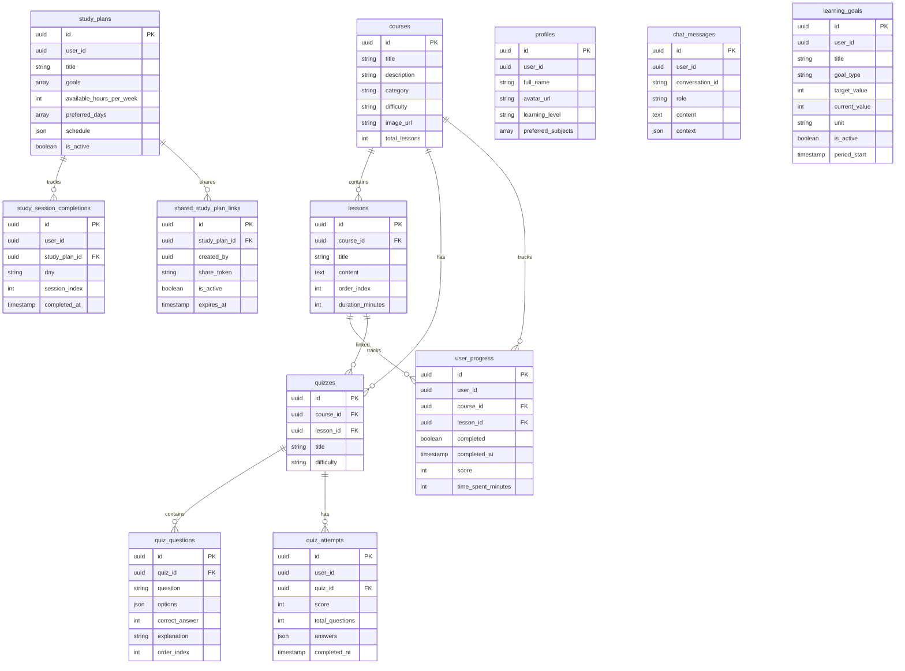

---

## 7. Data Flow Diagrams (DFD)

### 7.1 Context Diagram (Level 0)

> 📄 Diagram file: `diagrams/03_dfd_level0.mmd`

**External Entities:** Student, AI Service (LLM)  
**System:** AI Learning Assistant  
**Data Flows:**
- Student → System: Login credentials, quiz answers, chat messages, study preferences
- System → Student: Course content, quiz scores, AI responses, study plans, analytics
- System → AI Service: Prompts (tutor queries, plan generation)
- AI Service → System: AI-generated responses

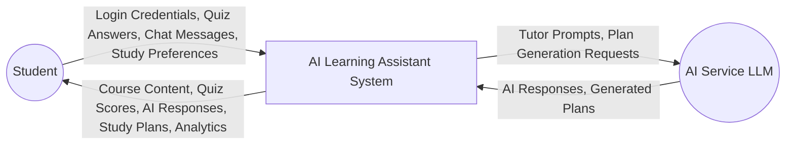

### 7.2 Level 1 DFD

> 📄 Diagram file: `diagrams/04_dfd_level1.mmd`

**Processes:**
1. **P1 - Authenticate User:** Validates credentials, manages sessions
2. **P2 - Manage Courses:** Fetches courses/lessons, tracks completion
3. **P3 - Process Quizzes:** Loads questions, scores answers, stores attempts
4. **P4 - AI Tutoring:** Sends messages to LLM, stores conversation history
5. **P5 - Generate Study Plan:** Collects preferences, calls AI, stores plan
6. **P6 - Dashboard Analytics:** Aggregates progress data, computes streaks

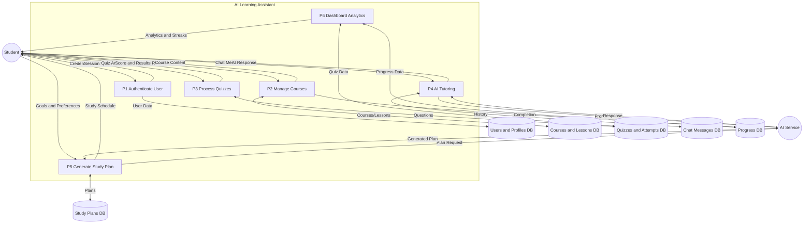

---

## 8. Use Case Diagram

> 📄 Diagram file: `diagrams/05_use_cases.mmd`

### 8.1 Use Case Table

| ID | Use Case | Actor | Description |
|----|----------|-------|-------------|
| UC-01 | Register Account | Guest | Create account with email, password, full name |
| UC-02 | Login | Guest | Authenticate with email & password |
| UC-03 | Browse Courses | Student | View list of available courses with details |
| UC-04 | View Lessons | Student | Read lesson content within a course |
| UC-05 | Mark Lesson Complete | Student | Toggle lesson completion status |
| UC-06 | Take Quiz | Student | Answer questions and submit for scoring |
| UC-07 | View Quiz Results | Student | See score, correct answers, explanations |
| UC-08 | Chat with AI Tutor | Student | Ask questions, get AI-powered responses |
| UC-09 | Generate Study Plan | Student | Input goals/preferences, receive AI plan |
| UC-10 | Share Study Plan | Student | Create shareable link for a study plan |
| UC-11 | Export Study Plan PDF | Student | Download study plan as PDF document |
| UC-12 | View Dashboard | Student | See progress analytics, streaks, heatmap |
| UC-13 | Update Profile | Student | Change name, learning level, subjects |
| UC-14 | View Shared Plan | Shared User | Access study plan via share link |
| UC-15 | Set Learning Goals | Student | Create weekly/monthly learning targets |
| UC-16 | Logout | Student | End session and return to landing page |

### 8.2 Use Case Diagram (Mermaid)

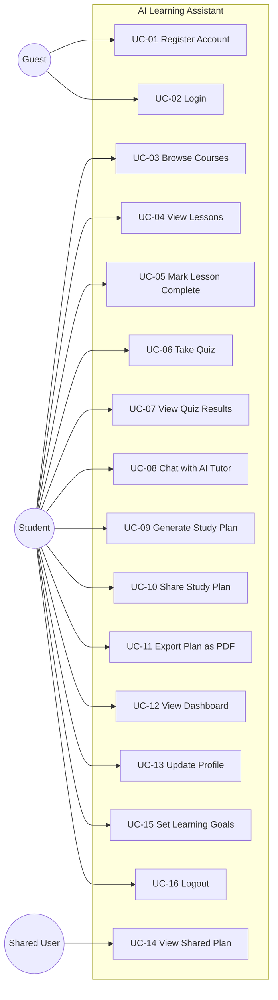

---

## 9. Sequence Diagrams

### 9.1 Authentication Flow

> 📄 Diagram file: `diagrams/06_sequence_auth.mmd`

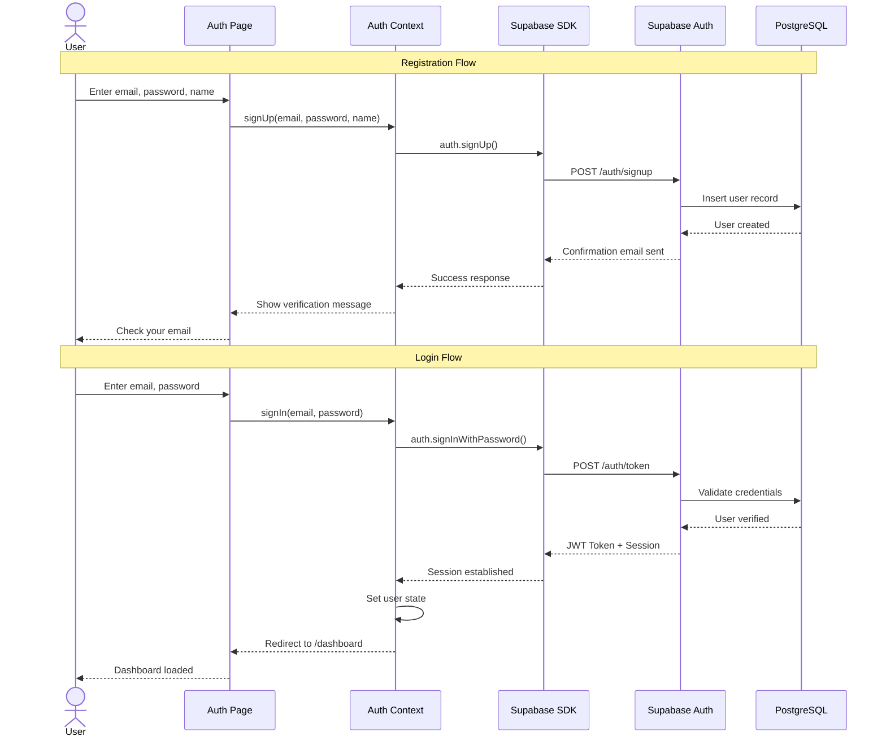

### 9.2 Quiz Flow

> 📄 Diagram file: `diagrams/07_sequence_quiz.mmd`

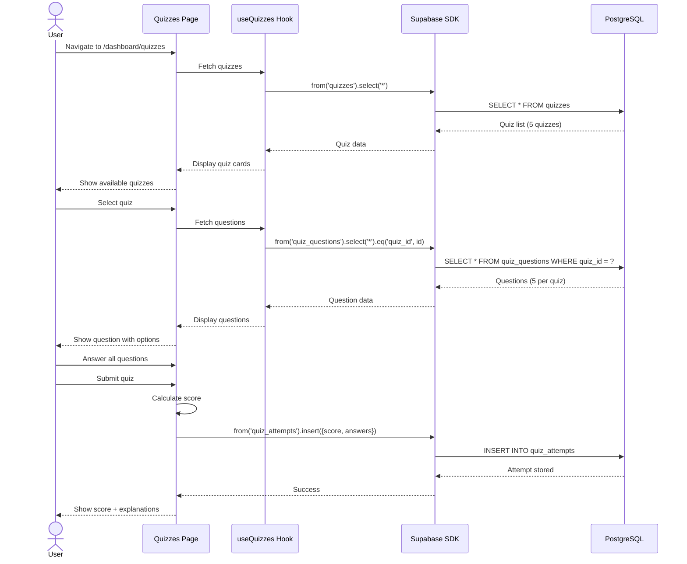

### 9.3 AI Tutor Flow

> 📄 Diagram file: `diagrams/08_sequence_ai_tutor.mmd`

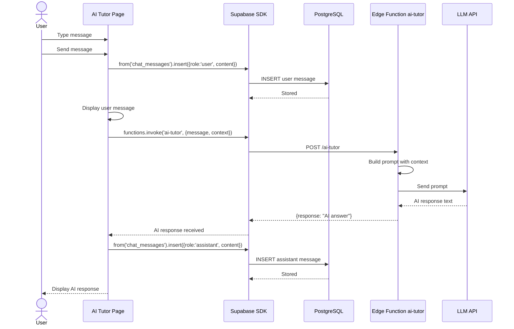

---

## 10. Activity Diagrams

### 10.1 Quiz Activity Flow

> 📄 Diagram file: `diagrams/09_activity_quiz.mmd`

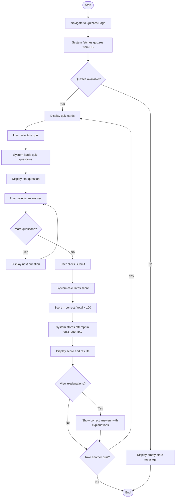

### 10.2 Course Learning Activity Flow

> 📄 Diagram file: `diagrams/10_activity_course.mmd`

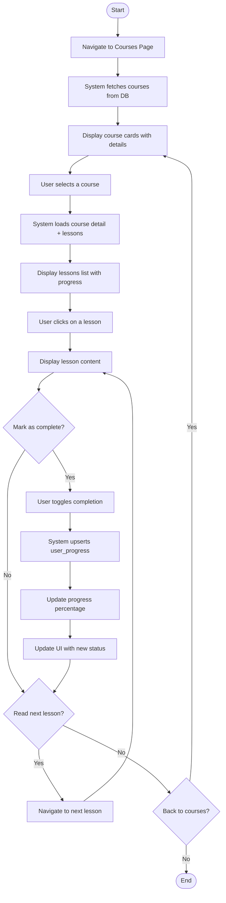

---

## 11. Component Structure

> 📄 Diagram file: `diagrams/11_component_structure.mmd`

### 11.1 Component Hierarchy

```
App
├── AuthProvider (Context)
│   ├── QueryClientProvider (TanStack)
│   │   ├── BrowserRouter
│   │   │   ├── PublicRoute
│   │   │   │   ├── Index (Landing Page)
│   │   │   │   └── Auth (Login/Signup)
│   │   │   ├── ProtectedRoute
│   │   │   │   └── DashboardLayout
│   │   │   │       ├── Dashboard
│   │   │   │       │   ├── StudyStreakWidget
│   │   │   │       │   ├── ActivityHeatmap
│   │   │   │       │   └── StrengthsWeaknesses
│   │   │   │       ├── Courses
│   │   │   │       │   └── CourseDetail
│   │   │   │       ├── Quizzes
│   │   │   │       │   └── QuizImprovementSuggestions
│   │   │   │       ├── AITutor
│   │   │   │       ├── StudyPlan
│   │   │   │       │   ├── StudyPlanGenerator
│   │   │   │       │   ├── StudyPlanViewer
│   │   │   │       │   ├── SharePlanDialog
│   │   │   │       │   ├── LearningGoals
│   │   │   │       │   ├── WeeklySummary
│   │   │   │       │   └── StudyAchievements
│   │   │   │       └── Settings
│   │   │   │           └── LearningPreferences
│   │   │   └── SharedPlan (Public)
│   │   │   └── NotFound (404)
```

### 11.2 Component Structure Diagram (Mermaid)

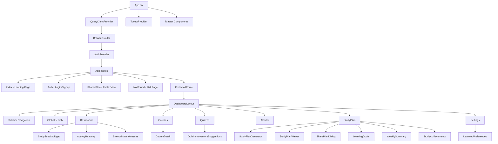

### 11.3 Custom Hooks

| Hook | Purpose | Data Source |
|------|---------|-------------|
| `useAuth()` | Auth state & methods | AuthContext |
| `useCourses()` | Fetch courses list | `courses` table |
| `useQuizzes()` | Fetch quizzes & questions | `quizzes`, `quiz_questions` |
| `useTopicsProgress()` | Track lesson completions | `user_progress` |
| `useStudyStreak()` | Calculate study streaks | `user_progress`, `quiz_attempts` |
| `useActivityHeatmap()` | Generate heatmap data | `user_progress`, `quiz_attempts` |
| `useWeeklyProgress()` | Weekly analytics | `user_progress` |
| `useRealtimeProgress()` | Live progress updates | Supabase Realtime |
| `useStudyReminders()` | Study reminder settings | Local state |
| `useGoalExpirationReminders()` | Goal deadline alerts | `learning_goals` |

---

## 12. Functional Requirements

### 12.1 Authentication (FR-01 to FR-04)

| ID | Requirement | Priority |
|----|-------------|----------|
| FR-01 | System shall allow users to register with email, password, and full name | High |
| FR-02 | System shall authenticate users via email/password login | High |
| FR-03 | System shall redirect authenticated users away from login page | Medium |
| FR-04 | System shall protect all dashboard routes from unauthenticated access | High |

### 12.2 Courses (FR-05 to FR-08)

| ID | Requirement | Priority |
|----|-------------|----------|
| FR-05 | System shall display all available courses with title, description, category, and difficulty | High |
| FR-06 | System shall show lessons within each course ordered by index | High |
| FR-07 | System shall allow students to mark lessons as complete/incomplete | High |
| FR-08 | System shall track and display course completion percentage | Medium |

### 12.3 Quizzes (FR-09 to FR-13)

| ID | Requirement | Priority |
|----|-------------|----------|
| FR-09 | System shall display available quizzes linked to courses | High |
| FR-10 | System shall load quiz questions with multiple-choice options | High |
| FR-11 | System shall auto-score quizzes upon submission | High |
| FR-12 | System shall store quiz attempts with scores and answers | High |
| FR-13 | System shall show correct answers with explanations after submission | Medium |

### 12.4 AI Tutor (FR-14 to FR-17)

| ID | Requirement | Priority |
|----|-------------|----------|
| FR-14 | System shall provide a chat interface for AI tutoring | High |
| FR-15 | System shall send user messages to AI model via Edge Function | High |
| FR-16 | System shall display AI responses in real-time | High |
| FR-17 | System shall persist chat history per conversation | Medium |

### 12.5 Study Plans (FR-18 to FR-23)

| ID | Requirement | Priority |
|----|-------------|----------|
| FR-18 | System shall generate personalized study plans using AI | High |
| FR-19 | System shall accept user goals, available hours, and preferred days | High |
| FR-20 | System shall display generated schedule in weekly view | Medium |
| FR-21 | System shall allow sharing study plans via unique links | Medium |
| FR-22 | System shall export study plans as PDF documents | Low |
| FR-23 | System shall track study session completions | Medium |

### 12.6 Dashboard (FR-24 to FR-28)

| ID | Requirement | Priority |
|----|-------------|----------|
| FR-24 | System shall display overall learning progress statistics | High |
| FR-25 | System shall show study streak (current and best) | Medium |
| FR-26 | System shall render activity heatmap (GitHub-style) | Medium |
| FR-27 | System shall analyze strengths and weaknesses by quiz category | Medium |
| FR-28 | System shall show recent quiz performance with scores | Medium |

---

## 13. Non-Functional Requirements

| ID | Category | Requirement |
|----|----------|-------------|
| NFR-01 | Performance | Pages shall load within 3 seconds on 4G connection |
| NFR-02 | Performance | Quiz scoring shall complete within 500ms |
| NFR-03 | Scalability | System shall support 1000+ concurrent users |
| NFR-04 | Security | All database tables shall have RLS policies |
| NFR-05 | Security | Authentication shall use JWT tokens with secure session management |
| NFR-06 | Security | API keys shall be stored as environment variables, never in code |
| NFR-07 | Usability | UI shall be responsive (mobile, tablet, desktop) |
| NFR-08 | Usability | System shall provide toast notifications for user actions |
| NFR-09 | Reliability | System shall handle API errors gracefully with user-friendly messages |
| NFR-10 | Availability | System shall target 99.5% uptime via managed cloud infrastructure |
| NFR-11 | Compatibility | System shall work on Chrome, Firefox, Safari, Edge (latest 2 versions) |
| NFR-12 | Maintainability | Code shall use TypeScript for type safety across the codebase |

---

## 14. System Interfaces

### 14.1 Frontend ↔ Supabase SDK

```typescript
// Database operations
supabase.from('courses').select('*')
supabase.from('quiz_attempts').insert({ ... })
supabase.from('user_progress').upsert({ ... })

// Authentication
supabase.auth.signUp({ email, password })
supabase.auth.signInWithPassword({ email, password })
supabase.auth.signOut()
supabase.auth.getSession()

// Edge Functions
supabase.functions.invoke('ai-tutor', { body: { message, context } })
supabase.functions.invoke('generate-study-plan', { body: { goals, hours, days } })

// Realtime subscriptions
supabase.channel('progress').on('postgres_changes', { event: '*', schema: 'public' }, callback)
```

### 14.2 Edge Function APIs

| Endpoint | Method | Input | Output |
|----------|--------|-------|--------|
| `/ai-tutor` | POST | `{ message, conversation_id, context }` | `{ response: string }` |
| `/generate-study-plan` | POST | `{ goals[], hours, preferred_days[] }` | `{ schedule: JSON }` |

### 14.3 Database Function

| Function | Input | Output | Description |
|----------|-------|--------|-------------|
| `get_shared_study_plan` | `p_share_token: string` | `JSON` | Retrieves study plan data by share token |

---

## 15. Security & RLS Policies

### 15.1 Row-Level Security Overview

All tables have RLS enabled. Policies ensure users can only access their own data:

```sql
-- Example: Users can only read their own quiz attempts
CREATE POLICY "Users can view own quiz attempts"
ON public.quiz_attempts FOR SELECT
TO authenticated
USING (auth.uid() = user_id);

-- Example: Users can only insert their own progress
CREATE POLICY "Users can insert own progress"
ON public.user_progress FOR INSERT
TO authenticated
WITH CHECK (auth.uid() = user_id);
```

### 15.2 Public vs Protected Data

| Access Level | Tables |
|-------------|--------|
| Public Read | `courses`, `lessons`, `quizzes`, `quiz_questions` |
| Authenticated Read (own data) | `profiles`, `user_progress`, `quiz_attempts`, `chat_messages`, `study_plans`, `learning_goals` |
| Public Read (via token) | `shared_study_plan_links` (active links only) |

### 15.3 Authentication Security
- Passwords hashed using bcrypt (Supabase Auth default)
- JWT tokens with expiration
- Session refresh handled automatically by Supabase SDK
- Protected routes enforce authentication at component level

---

## 16. Testing Strategy

### 16.1 Testing Levels

| Level | Tool | Scope |
|-------|------|-------|
| Unit Testing | Vitest | Individual functions, hooks, utilities |
| Component Testing | Testing Library + Vitest | React component rendering & behavior |
| Integration Testing | Vitest + Supabase SDK | API calls, data flow, auth flow |
| End-to-End Testing | Manual Browser Testing | Complete user journeys |

### 16.2 Test Cases

| TC-ID | Module | Test Case | Expected Result |
|-------|--------|-----------|-----------------|
| TC-01 | Auth | Register with valid credentials | Account created, redirect to verify email |
| TC-02 | Auth | Login with valid credentials | Session established, redirect to dashboard |
| TC-03 | Auth | Login with invalid password | Error toast displayed |
| TC-04 | Courses | Load courses page | 6 courses displayed with details |
| TC-05 | Courses | Open course detail | Lessons listed in order |
| TC-06 | Courses | Mark lesson complete | Progress updated, UI reflects change |
| TC-07 | Quizzes | Start a quiz | Questions loaded with options |
| TC-08 | Quizzes | Submit quiz answers | Score calculated and displayed |
| TC-09 | Quizzes | View quiz explanations | Correct answers shown with explanations |
| TC-10 | AI Tutor | Send a message | AI response received and displayed |
| TC-11 | Study Plan | Generate plan with goals | Study schedule created and displayed |
| TC-12 | Study Plan | Share plan via link | Shareable URL generated |
| TC-13 | Dashboard | View study streak | Current and best streak shown |
| TC-14 | Dashboard | View activity heatmap | Calendar grid rendered with activity data |
| TC-15 | Settings | Update profile name | Name updated in database |

---

## 17. Deployment Architecture

> 📄 Diagram file: `diagrams/12_deployment.mmd`

```
┌─────────────────────┐     ┌─────────────────────────┐
│   User's Browser    │     │    CDN (Lovable)         │
│   ┌───────────┐     │────▶│   Static Assets          │
│   │ React SPA │     │     │   (HTML, JS, CSS)        │
│   └─────┬─────┘     │     └─────────────────────────┘
│         │           │
│         │ HTTPS     │     ┌─────────────────────────┐
│         └───────────│────▶│   Supabase Cloud         │
│                     │     │   ┌─────────────────┐   │
│                     │     │   │ Auth Service     │   │
│                     │     │   ├─────────────────┤   │
│                     │     │   │ PostgREST API    │   │
│                     │     │   ├─────────────────┤   │
│                     │     │   │ Realtime Engine  │   │
│                     │     │   ├─────────────────┤   │
│                     │     │   │ Edge Functions   │   │
│                     │     │   ├─────────────────┤   │
│                     │     │   │ PostgreSQL DB    │   │
│                     │     │   └─────────────────┘   │
│                     │     └─────────────────────────┘
└─────────────────────┘
```

### Deployment Diagram (Mermaid)

```mermaid
graph TB
    subgraph UserDevice["User Device"]
        Browser["Web Browser - Chrome / Firefox / Safari / Edge"]
    end

    subgraph CDN["CDN - Lovable Hosting"]
        Static["Static Assets - HTML, JS, CSS, Images - Built with Vite"]
    end

    subgraph SupabaseCloud["Supabase Cloud Infrastructure"]
        AuthSvc["Auth Service - JWT Authentication"]
        PostgREST["PostgREST - Auto-generated REST API"]
        RealtimeEng["Realtime Engine - WebSocket Server"]
        EdgeRuntime["Edge Functions Runtime - Deno Deploy"]
        
        subgraph EdgeFunctions["Edge Functions"]
            AiTutor["ai-tutor - Chat with LLM"]
            GenPlan["generate-study-plan - AI Study Plan"]
        end
        
        subgraph Database["PostgreSQL Database"]
            Tables["12 Tables with RLS Policies"]
            Functions["Database Functions - get_shared_study_plan"]
        end
        
        EdgeRuntime --> EdgeFunctions
        AuthSvc --> Database
        PostgREST --> Database
        RealtimeEng --> Database
        EdgeFunctions --> Database
    end

    subgraph External["External Services"]
        LLM["LLM API - AI Language Model"]
    end

    Browser -->|"HTTPS GET"| CDN
    CDN -->|"Static Files"| Browser
    Browser -->|"HTTPS REST"| PostgREST
    Browser -->|"HTTPS Auth"| AuthSvc
    Browser -->|"WSS"| RealtimeEng
    Browser -->|"HTTPS Invoke"| EdgeRuntime
    EdgeFunctions -->|"API Call"| LLM
```

---

## 18. Future Enhancements

| Priority | Feature | Description |
|----------|---------|-------------|
| High | Video Lessons | Embed video content within lessons |
| High | Adaptive Quizzes | AI adjusts difficulty based on performance |
| Medium | Spaced Repetition | Flashcard-style review system |
| Medium | Collaborative Study | Group study rooms with shared progress |
| Medium | Mobile App | React Native version for iOS/Android |
| Low | Gamification | Badges, leaderboards, XP points |
| Low | Face Recognition | Identity verification for assessments |
| Low | Content Summarization | AI-powered lesson summaries |

---

## 19. Diagram Files Index

All diagrams are available as Mermaid (`.mmd`) files in the `diagrams/` folder:

| File | Diagram |
|------|---------|
| `diagrams/01_system_architecture.mmd` | System Architecture |
| `diagrams/02_er_diagram.mmd` | Entity-Relationship Diagram |
| `diagrams/03_dfd_level0.mmd` | DFD Level 0 (Context) |
| `diagrams/04_dfd_level1.mmd` | DFD Level 1 |
| `diagrams/05_use_cases.mmd` | Use Case Diagram |
| `diagrams/06_sequence_auth.mmd` | Sequence: Authentication |
| `diagrams/07_sequence_quiz.mmd` | Sequence: Quiz Flow |
| `diagrams/08_sequence_ai_tutor.mmd` | Sequence: AI Tutor |
| `diagrams/09_activity_quiz.mmd` | Activity: Quiz Process |
| `diagrams/10_activity_course.mmd` | Activity: Course Learning |
| `diagrams/11_component_structure.mmd` | Component Structure |
| `diagrams/12_deployment.mmd` | Deployment Architecture |

---

## 20. References

1. IEEE 830-1998 — IEEE Recommended Practice for Software Requirements Specifications
2. React Documentation — https://react.dev
3. Supabase Documentation — https://supabase.com/docs
4. TypeScript Handbook — https://www.typescriptlang.org/docs
5. Tailwind CSS Documentation — https://tailwindcss.com/docs
6. shadcn/ui Components — https://ui.shadcn.com
7. Vite Build Tool — https://vitejs.dev
8. TanStack React Query — https://tanstack.com/query
9. PostgreSQL Documentation — https://www.postgresql.org/docs
10. Recharts Library — https://recharts.org

---

*Document generated for AI Learning Assistant v1.0 — March 2026*
